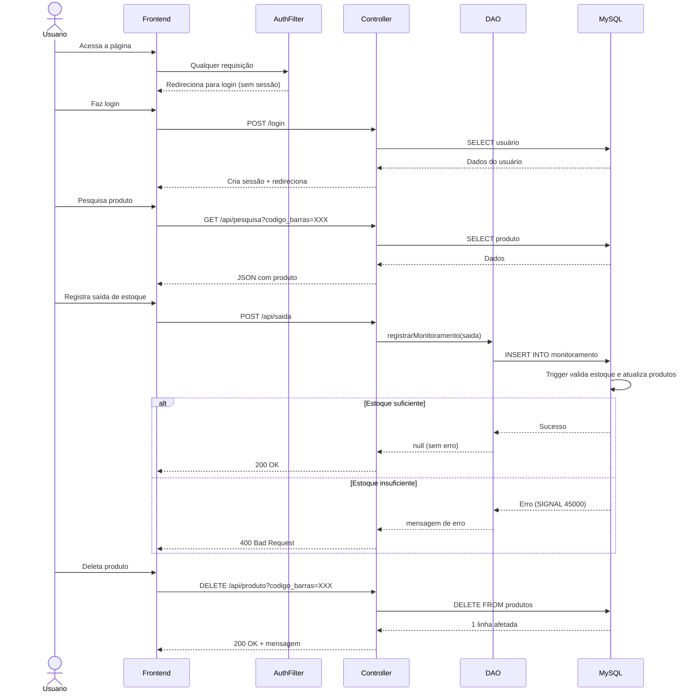

# 📦 Sistema de Estoque

Sistema web para gerenciamento de estoque com controle de entrada e saída de produtos, monitoramento de movimentações e painel de métricas em tempo real.

---

## 🚀 Tecnologias

| Camada | Tecnologia |
|--------|-----------|
| Backend | Java 21 + Jakarta EE 11 (Servlets) |
| Banco de dados | MySQL 8 |
| Frontend | HTML, CSS, JavaScript puro |
| Build | Maven 3 (empacotado como `.war`) |
| Containerização | Docker + Docker Compose |
| Segurança | BCrypt (jBCrypt 0.4) |
| Serialização JSON | Gson 2.10.1 |

---

## 📁 Estrutura do Projeto

```
sistemaDeEstoque/
├── src/main/
│   ├── java/
│   │   ├── connection/
│   │   │   └── ConnectionFactory.java       # Fábrica de conexão com o banco
│   │   ├── controller/
│   │   │   ├── LoginServlet.java            # POST /login
│   │   │   ├── LogoutController.java        # GET  /logout
│   │   │   ├── CadastroController.java      # POST /pages/cadastro (usuários)
│   │   │   ├── CadastroProdutosController.java  # POST /cadastroProdutos
│   │   │   ├── UpdateProdutosController.java    # POST /UpdateProdutos
│   │   │   ├── DeleteProdutoController.java     # DELETE /api/produto
│   │   │   ├── SaidaProdutoController.java      # POST /api/saida
│   │   │   ├── PesquisaController.java          # GET  /api/pesquisa
│   │   │   ├── EstoqueController.java           # GET  /api/estoque
│   │   │   ├── GerenciamentoController.java     # GET  /api/gerenciamento
│   │   │   ├── MonitoramentoController.java     # GET  /api/monitoramento
│   │   │   ├── GraficoController.java           # GET  /api/grafico
│   │   │   ├── ResumoEstoqueController.java     # GET  /api/resumo
│   │   │   └── PerfilController.java            # GET  /api/perfil
│   │   ├── dao/
│   │   │   ├── CadastroProdutosDAO.java
│   │   │   ├── UpdateProdutoDAO.java
│   │   │   ├── MonitoramentoDAO.java
│   │   │   ├── CadastroUsersDAO.java
│   │   │   └── UserDAO.java
│   │   ├── Exception/
│   │   │   ├── ExceptionsHandles.java       # Validações de cadastro (data, quantidade, total)
│   │   │   ├── ValidaçãoExceptions.java     # Exception base
│   │   │   ├── ValidarDataExceptions.java
│   │   │   ├── ValidarQuantidadeExceptions.java
│   │   │   └── ValidarTotalExceptions.java
│   │   ├── model/
│   │   │   ├── CadastroProdutoModel.java
│   │   │   ├── MonitoramentoModel.java
│   │   │   ├── CadastroUsuarioModel.java
│   │   │   └── UserModel.java
│   │   └── util/
│   │       ├── AuthFilter.java              # Filtro de autenticação e permissões
│   │       └── SenhaUtil.java               # Hash BCrypt
│   └── webapp/
│       ├── pages/
│       │   ├── dashboard.html
│       │   ├── gerenciamento.html
│       │   ├── cadastro.html
│       │   └── cadastroProdutos.html
│       ├── js/
│       │   ├── pesquisar.js
│       │   ├── gerenciamento.js
│       │   ├── monitoramento.js
│       │   ├── dashboard.js
│       │   └── ...
│       └── css/
├── db/
│   └── init.sql          # Criação das tabelas, trigger de saída e usuários padrão
├── docker-compose.yml
├── dockerfile
└── pom.xml
```

---

## 🗄️ Banco de Dados

```sql
-- Usuários do sistema
users (id, username, passwords, nameFirst, sobreNome, matricula,
       cpf, sexo, dtaNascimento, email, telefone, funcao,
       cep, endereco, cidade, bairro, estado, numero, complemento)

-- Produtos em estoque (uma linha por código de barras = estado ATUAL do estoque)
produtos (id, codigo_barras UNIQUE, nome_produto, fabricante, marca,
          data_fabricacao, data_vencimento, quantidade, valor, total, status)

-- Histórico de movimentações (entrada/saída) — fonte de verdade do histórico
monitoramento (id, codigo_barras FK, nome_produto,
               tipo_movimentacao, quantidade, valor, data_hora)
```

> A tabela `monitoramento` possui `ON DELETE CASCADE` referenciando `produtos`, então ao deletar um produto seu histórico é removido automaticamente.

### ⚡ Trigger `trg_saida_atualiza_estoque`

Toda saída de produto é registrada com um único `INSERT` em `monitoramento`. Uma trigger `BEFORE INSERT` cuida do resto automaticamente, dentro da mesma transação:

1. Verifica se o produto existe e se há quantidade suficiente em `produtos`.
2. Se não houver estoque suficiente, **rejeita o INSERT** com `SIGNAL SQLSTATE '45000'` (a linha de saída nem chega a ser gravada).
3. Se houver, desconta a `quantidade` e recalcula o `total` direto na tabela `produtos`.

Isso garante que **nunca é possível registrar uma saída sem refletir no estoque**, mesmo que a aplicação trave no meio do processo — e a aplicação Java não precisa (nem deve) fazer esse desconto manualmente.

> ℹ️ **Importante sobre a separação de conceitos:** `produtos.status` só indica que aquele produto foi cadastrado (sempre `'entrada'`) — ele representa o estoque **atual**, não um histórico de movimentação. Quem guarda entradas e saídas como eventos separados, ao longo do tempo, é a tabela `monitoramento`. O dashboard, o gráfico e o resumo de métricas leem de `monitoramento` para números históricos, e de `produtos` para o estoque disponível agora.

---

## 📐 Diagrama de Classes

```mermaid
classDiagram

    class CadastroProdutoModel {
        -int id
        -String codigoBarras
        -String nomeProduto
        -String fabricante
        -String marca
        -String dataFabricacao
        -String dataVencimento
        -long quantidade
        -String valor
        -String total
        -String status
        +getters/setters()
    }

    class MonitoramentoModel {
        -int id
        -String codigoBarras
        -String nomeProduto
        -String tipoMovimentacao
        -long quantidade
        -String valor
        -String dataHora
        +getters/setters()
    }

    class UserModel {
        -int id
        -String username
        -String passwords
        -String funcao
        +getters/setters()
    }

    class CadastroProdutosDAO {
        +salvar(CadastroProdutoModel) boolean
        +listarComFiltro(nome, tipo, data) List
    }

    class UpdateProdutoDAO {
        +atualizar(CadastroProdutoModel) boolean
    }

    class MonitoramentoDAO {
        +registrarMonitoramento(MonitoramentoModel) String
        +listarTodos() List
        +listarPorItem(tipo) List
    }

    class UserDAO {
        +buscarPorUsername(username) UserModel
    }

    class ExceptionsHandles {
        +validarData(dataVenci, dataFab) void
        +validarQuantidade(quantidade) void
        +validarTotal(total) void
    }

    class CadastroProdutosController {
        +doPost(request, response)
    }

    class UpdateProdutosController {
        +doPost(request, response)
    }

    class SaidaProdutoController {
        +doPost(request, response)
    }

    class DeleteProdutoController {
        +doDelete(request, response)
    }

    class PesquisaController {
        +doGet(request, response)
    }

    class GerenciamentoController {
        +doGet(request, response)
    }

    class MonitoramentoController {
        +doGet(request, response)
    }

    class GraficoController {
        +doGet(request, response)
    }

    class ResumoEstoqueController {
        +doGet(request, response)
    }

    class AuthFilter {
        +doFilter(request, response, chain)
    }

    CadastroProdutosController --> CadastroProdutosDAO
    CadastroProdutosController --> MonitoramentoDAO
    CadastroProdutosController --> CadastroProdutoModel
    CadastroProdutosController --> MonitoramentoModel
    CadastroProdutosController --> ExceptionsHandles

    UpdateProdutosController --> UpdateProdutoDAO
    UpdateProdutosController --> MonitoramentoDAO
    UpdateProdutosController --> CadastroProdutoModel
    UpdateProdutosController --> MonitoramentoModel

    SaidaProdutoController --> MonitoramentoDAO
    SaidaProdutoController --> MonitoramentoModel

    DeleteProdutoController --> ConnectionFactory

    PesquisaController --> ConnectionFactory
    GerenciamentoController --> ConnectionFactory
    MonitoramentoController --> MonitoramentoDAO
    GraficoController --> ConnectionFactory
    ResumoEstoqueController --> ConnectionFactory

    CadastroProdutosDAO --> CadastroProdutoModel
    MonitoramentoDAO --> MonitoramentoModel
    UserDAO --> UserModel
```



---

## 🔄 Fluxo das Requisições



---

## 🔐 Autenticação e Perfis

O sistema usa `HttpSession` para controle de sessão e o filtro `AuthFilter` intercepta **todas** as requisições (`/*`), verificando:

- Se a rota é pública (login, css, js) → deixa passar
- Se não há sessão ativa → redireciona para `index.html`
- Se a rota for de **cadastro de usuário** (`/pages/cadastro`) e o perfil não for `admin` → `403 Forbidden`
- Se a rota for de **cadastro de produto** (`/cadastroProdutos`) e o perfil não for `admin` nem `user` → `403 Forbidden`

| Perfil | Cadastrar usuário | Cadastrar produto | Ver dashboard / gerenciamento |
|--------|:---:|:---:|:---:|
| `admin` | ✅ | ✅ | ✅ |
| `user` | ❌ | ✅ | ✅ |

Senhas armazenadas com hash **BCrypt** via `SenhaUtil`.

### 👤 Contas de teste (seed via `db/init.sql`)

O banco já sobe com duas contas pré-cadastradas, uma de cada perfil, pra facilitar testar as permissões:

| Usuário | Senha | Perfil |
|---------|-------|--------|
| `admin` | `145` | `admin` |
| `perfil` | `perfil123` | `user` |

> ⚠️ **Essas são credenciais de desenvolvimento/avaliação**, fixas no script de inicialização do banco (`db/init.sql`) só pra facilitar rodar e testar o projeto localmente. Não devem ser usadas (nem o script deve ser reaproveitado do jeito que está) em qualquer ambiente exposto publicamente — em produção, crie usuários reais com senhas próprias e remova esses `INSERT`s do script.

---

## 🌐 Endpoints da API

| Método | Endpoint | Descrição |
|--------|----------|-----------|
| `POST` | `/login` | Autenticação do usuário |
| `GET` | `/logout` | Encerra a sessão |
| `POST` | `/pages/cadastro` | Cadastra novo usuário (somente `admin`) |
| `POST` | `/cadastroProdutos` | Cadastra novo produto (entrada de estoque) |
| `POST` | `/UpdateProdutos` | Atualiza dados de um produto existente |
| `POST` | `/api/saida` | Registra saída de estoque (desconta via trigger) |
| `DELETE` | `/api/produto?codigo_barras=` | Deleta produto |
| `GET` | `/api/pesquisa?codigo_barras=` | Busca produto por código |
| `GET` | `/api/estoque` | Lista produtos, com filtros opcionais (`nome`, `tipo`, `data`) |
| `GET` | `/api/gerenciamento` | Resumo e métricas do estoque (itens, estoque baixo, valor total) |
| `GET` | `/api/monitoramento` | Histórico de movimentações |
| `GET` | `/api/grafico` | Estoque atual x total histórico de saídas, por produto (top 5) |
| `GET` | `/api/resumo` | Totais agregados de entrada/saída/saldo, a partir do `monitoramento` |
| `GET` | `/api/perfil` | Retorna o perfil do usuário logado |

---

## ⚙️ Como Rodar

### Pré-requisitos
- Docker e Docker Compose instalados
- Java 21+ e Maven (para desenvolvimento local, opcional)

### Com Docker

**1. Clone o repositório**
```bash
git clone https://github.com/seu-usuario/sistemaDeEstoque.git
cd sistemaDeEstoque
```

**2. Configure as variáveis de ambiente**
```bash
cp .env.example .env
# Edite o .env com suas configurações
```

**3. Suba os containers**
```bash
docker compose up --build
```

O banco de dados é inicializado automaticamente com o script `db/init.sql` (tabelas, trigger de saída e as duas contas de teste) **na primeira vez que o container sobe** — se você já tem um volume `db_data` de uma execução anterior, o script não roda de novo. Pra recriar do zero:

```bash
docker compose down -v
docker compose up --build
```

**4. Acesse o sistema**
```
http://localhost:8080
```

### Variáveis de Ambiente

| Variável | Descrição |
|----------|-----------|
| `MYSQL_ROOT_PASSWORD` | Senha root do MySQL |
| `MYSQL_DATABASE` | Nome do banco (`estoque_db1`) |
| `DB_PORT_EXTERNAL` | Porta exposta do MySQL (ex: `3306`) |
| `DB_USER` | Usuário do banco |

---

## 📊 Funcionalidades

- **Dashboard** — visão geral do estoque com cards de entrada/saída/saldo (calculados em tempo real a partir do histórico de movimentações) e gráfico comparando estoque atual x total de saídas por produto
- **Cadastro de Produtos** — formulário completo com código de barras, fabricante, marca, datas e valor; toda entrada gera automaticamente um registro no histórico de monitoramento
- **Registrar Saída** — retirada de estoque validada e aplicada de forma atômica por uma trigger no banco de dados, impedindo saldo negativo
- **Gerenciamento** — pesquisa por código de barras com edição inline, deleção com confirmação e registro de saída
- **Monitoramento** — histórico de todas as movimentações (entrada/saída), com data e hora
- **Alertas de estoque baixo** — produtos com quantidade abaixo de 10 unidades são destacados
- **Perfis de acesso** — `admin` (acesso total, incluindo cadastro de usuários) e `user` (acesso operacional: cadastro de produtos, saída, dashboard e gerenciamento)

---