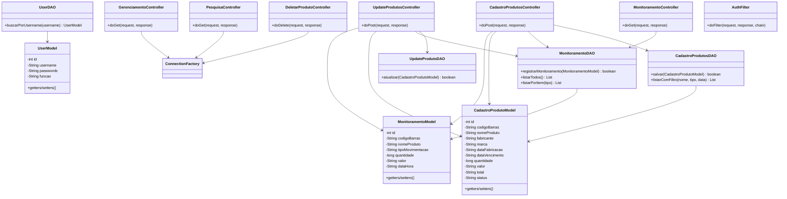
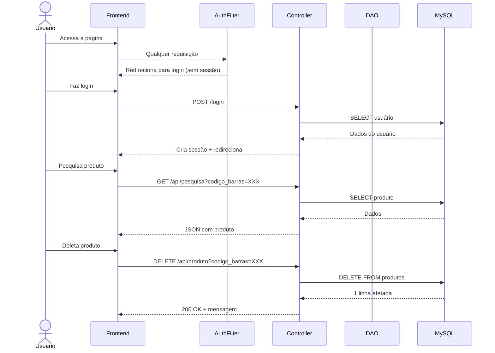

# 📦 Sistema de Estoque

Sistema web para gerenciamento de estoque com controle de entrada e saída de produtos, monitoramento de movimentações e painel de métricas em tempo real.

---

## 🚀 Tecnologias

| Camada | Tecnologia |
|--------|-----------|
| Backend | Java 21 + Jakarta EE 11 (Servlets) |
| Banco de dados | MySQL 8 |
| Frontend | HTML, CSS, JavaScript puro |
| Build | Maven 3 (empacotado como `.war`) |
| Containerização | Docker + Docker Compose |
| Segurança | BCrypt (jBCrypt 0.4) |
| Serialização JSON | Gson 2.10.1 |

---

## 📁 Estrutura do Projeto

```
sistemaDeEstoque/
├── src/main/
│   ├── java/
│   │   ├── connection/
│   │   │   └── ConnectionFactory.java       # Fábrica de conexão com o banco
│   │   ├── controller/
│   │   │   ├── LoginServlet.java            # POST /login
│   │   │   ├── LogoutController.java        # GET  /logout
│   │   │   ├── CadastroController.java      # POST /cadastro (usuários)
│   │   │   ├── CadastroProdutosController.java  # POST /cadastroProdutos
│   │   │   ├── UpdateProdutosController.java    # POST /UpdateProdutos
│   │   │   ├── DeletarProdutoController.java    # DELETE /api/produto
│   │   │   ├── PesquisaController.java          # GET  /api/pesquisa
│   │   │   ├── EstoqueController.java           # GET  /api/estoque
│   │   │   ├── GerenciamentoController.java     # GET  /api/gerenciamento
│   │   │   ├── MonitoramentoController.java     # GET  /api/monitoramento
│   │   │   ├── GraficoController.java           # GET  /api/grafico
│   │   │   ├── ResumoEstoqueController.java     # GET  /api/resumo
│   │   │   └── PerfilController.java            # GET  /api/perfil
│   │   ├── dao/
│   │   │   ├── CadastroProdutosDAO.java
│   │   │   ├── UpdateProdutoDAO.java
│   │   │   ├── MonitoramentoDAO.java
│   │   │   ├── CadastroUsersDAO.java
│   │   │   └── UserDAO.java
│   │   ├── model/
│   │   │   ├── CadastroProdutoModel.java
│   │   │   ├── MonitoramentoModel.java
│   │   │   ├── CadastroUsuarioModel.java
│   │   │   └── UserModel.java
│   │   └── util/
│   │       ├── AuthFilter.java              # Filtro de autenticação global
│   │       └── SenhaUtil.java               # Hash BCrypt
│   └── webapp/
│       ├── pages/
│       │   ├── dashboard.html
│       │   ├── gerenciamento.html
│       │   ├── cadastro.html
│       │   └── cadastroProdutos.html
│       ├── js/
│       │   ├── pesquisar.js
│       │   ├── gerenciamento.js
│       │   ├── monitoramento.js
│       │   ├── dashboard.js
│       │   └── ...
│       └── css/
├── db/
│   └── init.sql                             # Script de criação das tabelas
├── docker-compose.yml
├── dockerfile
└── pom.xml
```

---

## 🗄️ Banco de Dados

```sql
-- Usuários do sistema
users (id, username, passwords, nameFirst, sobreNome, matricula,
       cpf, sexo, dtaNascimento, email, telefone, funcao,
       cep, endereco, cidade, bairro, estado, numero, complemento)

-- Produtos em estoque
produtos (id, codigo_barras UNIQUE, nome_produto, fabricante, marca,
          data_fabricacao, data_vencimento, quantidade, valor, total, status)

-- Histórico de movimentações (entrada/saída)
monitoramento (id, codigo_barras FK, nome_produto,
               tipo_movimentacao, quantidade, valor, data_hora)
```

> A tabela `monitoramento` possui `ON DELETE CASCADE` referenciando `produtos`, então ao deletar um produto seu histórico é removido automaticamente.

---

## 📐 Diagrama de Classes



---

## 🔄 Fluxo das Requisições



---

## 🔐 Autenticação e Perfis

O sistema usa `HttpSession` para controle de sessão e o filtro `AuthFilter` intercepta **todas** as requisições (`/*`), verificando:

- Se a rota é pública (login, css, js) → deixa passar
- Se não há sessão ativa → redireciona para `index.html`
- Se a rota exige perfil `admin` (cadastro de usuários e produtos) → retorna `403 Forbidden`

| Perfil | Permissões |
|--------|-----------|
| `admin` | Acesso total (cadastro, edição, deleção, gerenciamento) |
| `usuario` | Visualização do estoque e monitoramento |

Senhas armazenadas com hash **BCrypt** via `SenhaUtil`.

---

## 🌐 Endpoints da API

| Método | Endpoint | Descrição |
|--------|----------|-----------|
| `POST` | `/login` | Autenticação do usuário |
| `POST` | `/cadastroProdutos` | Cadastra novo produto |
| `POST` | `/UpdateProdutos` | Atualiza produto existente |
| `DELETE` | `/api/produto?codigo_barras=` | Deleta produto |
| `GET` | `/api/pesquisa?codigo_barras=` | Busca produto por código |
| `GET` | `/api/estoque` | Lista produtos com filtros |
| `GET` | `/api/gerenciamento` | Resumo e métricas do estoque |
| `GET` | `/api/monitoramento` | Histórico de movimentações |
| `GET` | `/api/grafico` | Dados para o gráfico de barras |

---

## ⚙️ Como Rodar

### Pré-requisitos
- Docker e Docker Compose instalados
- Java 21+ e Maven (para desenvolvimento local)

### Com Docker

**1. Clone o repositório**
```bash
git clone https://github.com/seu-usuario/sistemaDeEstoque.git
cd sistemaDeEstoque
```

**2. Configure as variáveis de ambiente**
```bash
cp .env.example .env
# Edite o .env com suas configurações
```

**3. Suba os containers**
```bash
docker-compose up --build
```

O banco de dados é inicializado automaticamente com o script `db/init.sql`.

**4. Acesse o sistema**
```
http://localhost:8080
```

### Variáveis de Ambiente

| Variável | Descrição |
|----------|-----------|
| `MYSQL_ROOT_PASSWORD` | Senha root do MySQL |
| `MYSQL_DATABASE` | Nome do banco (`estoque_db1`) |
| `DB_PORT_EXTERNAL` | Porta exposta do MySQL (ex: `3306`) |
| `DB_USER` | Usuário do banco |

---

## 📊 Funcionalidades

- **Dashboard** — visão geral do estoque com métricas e gráfico de barras entrada/saída por produto
- **Cadastro de Produtos** — formulário completo com código de barras, fabricante, marca, datas e valor
- **Gerenciamento** — pesquisa por código de barras com edição inline e deleção com confirmação
- **Monitoramento** — histórico paginado de todas as movimentações com filtro por tipo (entrada/saída)
- **Alertas de estoque baixo** — produtos com quantidade abaixo de 10 unidades são destacados

---
